# Data Scientist Challenge

Assume you are working in a credit card company that is expecting a recession in the near future. The company would like to maintain a certain percentage of credit card defaults out of all the users. You will work on a dataset for the set of credit card users and predict the probability of credit card defaults.

## Dataset

This dataset contains information on default payments, demographic factors, credit data, history of payments, and bill statements of credit card clients in Taiwan from April 2005 to September 2005.

## Part 1: Exploratory Data Analysis (EDA) and Extract-Transform-Load (ETL)

- Explore the whole dataset and find any interesting insights
- Evaluate the data quality and figure out whether outliners exist
- Select the strongest predictors and perform feature engineering

	1. `PAY_1` column is not defined in the data dictionary hence discarded
	2. 	`PAY_0`, and `PAY_2` to `PAY_6` are dropped because their inclusion would create multiple categories that may have very few elements, hence, possibly, making the model overfit. The column ID won't be useful for a prediction so it'll be dropped as well
	3. 	At first sight some records in some of the features that do not appear in the data dictionary. While these values might be grouped under others or unknown, unless this is agreed with domain experts, the best practice is to discard them.
		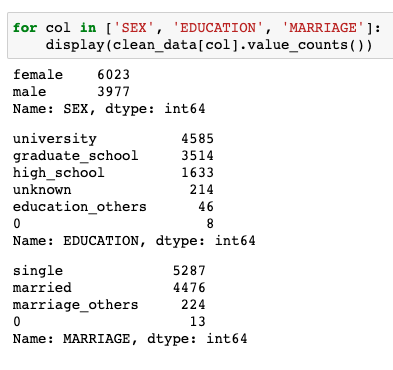
	4. Few elements in certain combinations of categories: in the first pass they were kept but they hampered the model performance hence they were discarded on the second iteration of the model
	5. Created a new feature `BAL_AMT = BILL_AMT - PAY_AMT`, and drop `BILL_AMT`, `PAY_AMT`. Having this feature should capture the same information and also making the model training faster by having one less feature to train on.
	6. This results in the features and target = default.payment.next.month:
	
		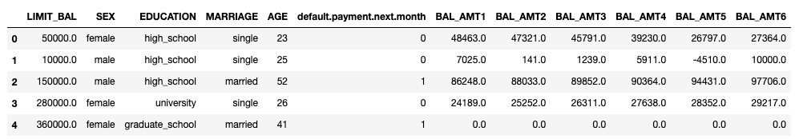
	
	From here there are some interesting insights, for example:
	
	- Most of the customers are in the 20-40 years old range.
		
		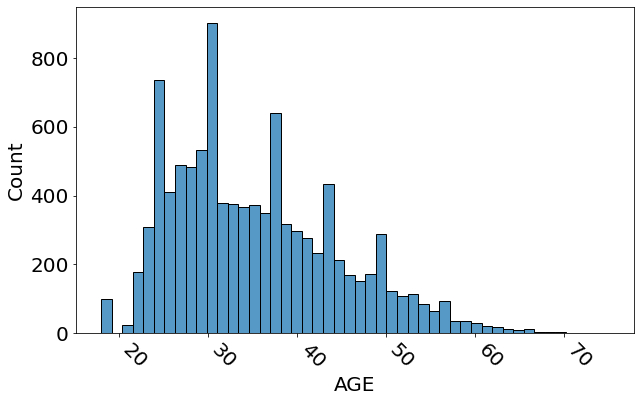
	
	- This plot is representative of the `BAL_AMT` features, which are mostly centered around 0 but there are some outliers, which for this exercise aren't discared though they could in further iterations.
	
		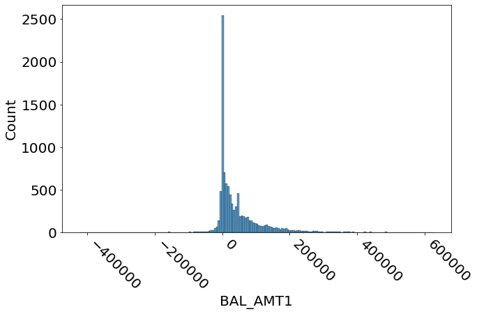
		
	- The target `default.payment.next.month` is unbalanced hence, after doing the train/test split the minority class `default.payment.next.month = 1` will be upscaled.

		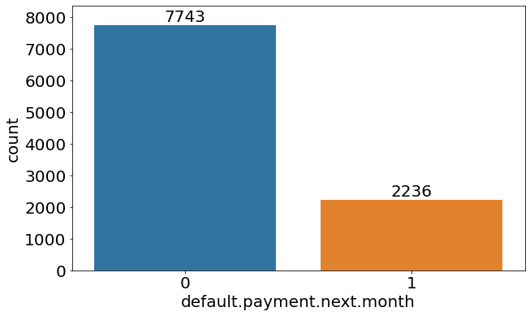
	
	- Some combinations of categorical features have very few elements hence it's hypothesised that they will hamper the model performance.

		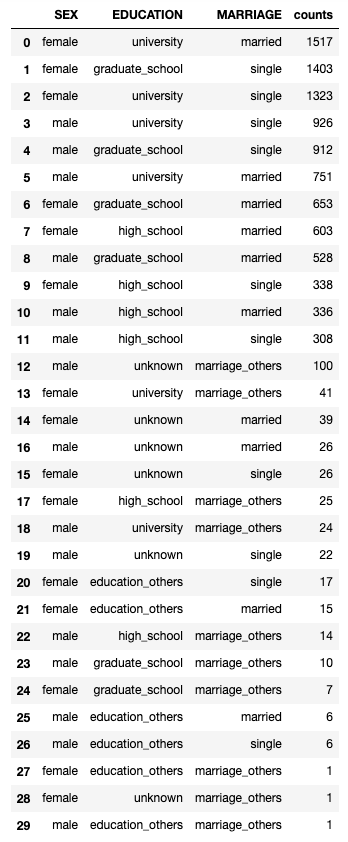


## Part 2: Prediction Modeling

- Train a model to predict whether a user will default or not
- The model is not expected to be perfectly accurate and precise, but instead try to build a simple one involving fewer features based on the limited time frame
- Evaluate the performance of model


	1. I selected an XGBoost classificator model for its versatility at the risk of overfitting the small dataset which became evident when doing a small training test
		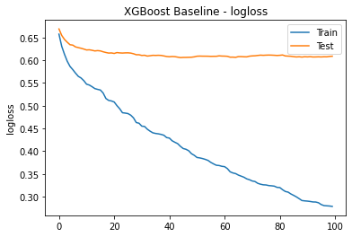
	2. After using GridSearchCV (with 3 folds due to the small amount of data) the resulting model has the following metrics:
	
		``` bash
		Metrics Train - accuracy: 0.93 f1: 0.94 precision: 0.91 recall: 0.97 roc_auc: 0.93
		Metrics Test - accuracy: 0.68 f1: 0.34 precision: 0.31 recall: 0.37 roc_auc: 0.57
		```
		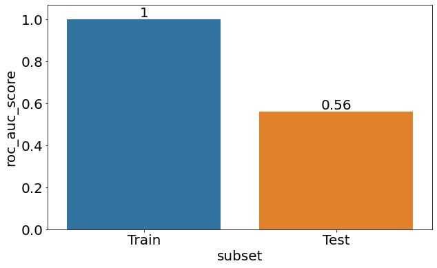
		
		It can be seen that the metrics in the training dataset are significantly better than in the test dataset, a sign that the model is overfitting. Hence in subsequent models a shallower model could be tested.
	3. I focus in the `ROC_AUC` metrics as it's the harmonic mean of precision and recall, avoiding the [`accuracy in imbalanced situations trap`](https://machinelearningmastery.com/failure-of-accuracy-for-imbalanced-class-distributions/). Though which metric to focus on can be discussed with the domain experts so the model is aligned with the business objectives. When taking a look into individual categories. When taking a look into the combination of categories I found that the ones that had fewer elemtents do hamper the performance of the model, and these are education = others and marriage = others

		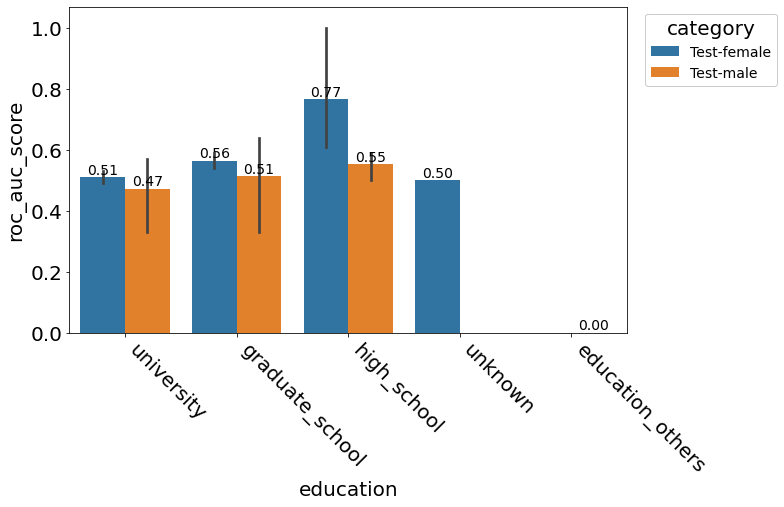
		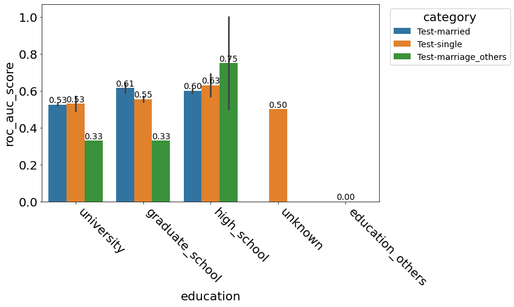
			
	4. Additionally the same combinations of categories with few elements do have little predictive power according to SHAP values
	
		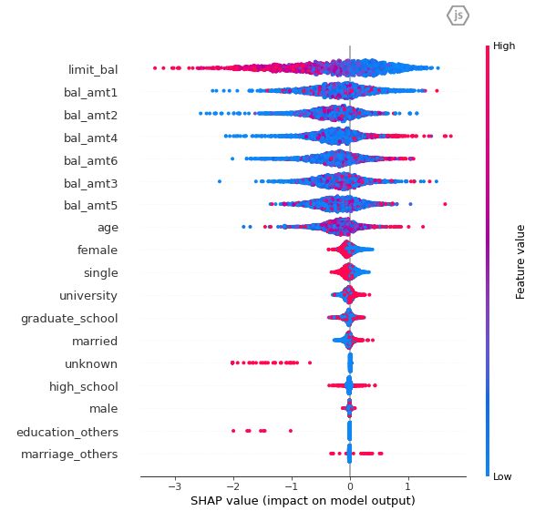
		
	5. These findings raise show us a couple of paths that we could follow to improve the model. These avenues are discussed in [Optional](#optional).
	

## Part 3: Model refinement

## Requirements

- [ x ] Jupyter Notebook for Exploratory Data Analysis (EDA) and Extract-Transform-Load (ETL):
	- [v0\_Baseline\_FeatureExploration/00\_ExploratoryAnalysis\_ETL.ipynb](v0_Baseline_FeatureExploration/00_ExploratoryAnalysis_ETL.ipynb): Contains the first pass of EDA and ETL, dropping features that would create subcategories with few items, have multiple nan values or undescribed values. As well a a new feature BAL\_AMT = BILL\_AMT - PAY\_AMT. Moreover, it was found that there are outliers in the numerical features and that also the categories to predict are umbalanced. Finally, the output of this is the data for training in its original format and one_hot_encoded in addition to the encoder.
	- [00\_ExploratoryAnalysis\_ETL](00_ExploratoryAnalysis_ETL.ipynb): Second iteration of EDA and ETL. Based on the findings of the first model training, some the categories with few elements were dropped, e.g. `education = others` and `marriage = others`. Exporting the data for training in its original format and one_hot_encoded in addition to the encoder.

- [ x ] Jupyter Notebook for Prediction Modeling:
	- [v0\_Baseline\_FeatureExploration/01\_Model.ipynb](v0_Baseline_FeatureExploration/01_Model.ipynb): First pass of the XGBoost model training. I split the data in train/test using a 80/20 split, stratified according to if the customer defaults or not and tuned using GridSearchCV. The training results show that, as expected, the categories  with few elements, e.g. `education = others` and `marriage = others`, impact the model negatively and as well have low predicting power according to SHAP values, hence in the next revision they are discarded.
	- [01\_Model.ipynb](v0_Baseline_FeatureExploration/01_Model.ipynb): Second iteration of the XGBoost model training. Following the same procedure that in the first pass the training results show that, in general there's an increase in AUC by a couple percentages for most categories or lowering the spread in its value. Therefore, confirming that the categories with few elements, e.g. `education = others` and `marriage = others`, impacted the model negatively. Moreover, the category education = unknown might be also considered to be discarded, but this is left for a further iteration of the model.

- [ ] Implementation in Python of a simple data model that can be trained and predict whether a user will default or not, let us know if you prefer something other than Python

The instructions on how to run them can be found in the [Deliverables](#deliverables) section.

## Optional

- [ x ] Draft a plan with multiple phases of work on how to tackle the problem, let us know what are the tradeoffs and considerations

	The general strategy was to:
	
	1. Do a first pass to create a model baseline, to which subsequent models could be compared, making a minimal ETL and feature creation which can be found in [v0\_Baseline\_FeatureExploration](v0_Baseline_FeatureExploration).
	2. Implement some of the learnings from the first pass and iterate in the feature creation and model training which can be found in [the current root folder](.).
	
	These two iterations had the same approach, that is to divide the work into two stages:

	- Import data, evaluate its quality and peform feature selection, done in the `00_ExploratoryAnalysis_ETL.ipynb` files, this means:
		- Discard features with multiple nan's or that aren't explained by the data dictionary.
		- Identify for numerical outliers, in this case these were kept in place which would allow to stablish a model baseline. This is work that could be done in a third pass of the model.
		- Few elements in certain combinations of categories: in the first pass they were kept but they hampered the model performance hence they were discarded on the second iteration of the model
		- Created a new feature `BAL_AMT = BILL_AMT - PAY_AMT`, and drop `BILL_AMT`, `PAY_AMT`. Having this feature should capture the same information and also making the model training faster by having one less feature to train on.

	- Model training, done in `01_Model.ipynb` files, for example:
		- Imbalanced predictive class: I decided to upscale the minority class, e.g. defaults, as this would allow to keep the richness of the majority class features.
		- Used an XGBoost classifier which is a versatile and powerful model, that doesn't require feature scaling, it's not affected by multicolinearity by default but is prone to overfitting in small datasets such as this one.
		- Tuned the model using GridSearchCV, which instead could be done using a bayesian or another hyperparameter method that allows 'educated guesses' of hyperparameters resulting in fewer evaluations and a more accurate model.


- [ x ] Let us know what improvements can be made if we have more time and resources

1. From the first model training I can suggest he following.

	Dataset and feature improvements:
	
	- The categories with small number of records, for example `education = others`, should be discarded as they hamper the training, metrics and they have low predictive value according to shap and importances.
	- Limit outliers in numerical features, for example using inter-quantile ranges.
	- Do a more advanced feature selectior, for example using Chi-Squared, Mutual or others.
	
	
	Additionally, acquiring a larger dataset that could unlock the following advantages:
	
	- Make the categories with fewer items be more significant
	- Consider including the PAY categories if there's more data to fill the many more categories to be created.
	- Have a validation dataset would help studying overfitting.
	
	In terms of model training and evaluation:
	
	- Better hyperparameter optimisation method for example a bayesian based one.
	- Study the decision tree (the necessary libraries, Graphviz make the environment a bit more difficult to transfer the environment)
	- Evaluate other models, perhaps a Neural Network. Though it's my educated belief that the effort might not pay off.
	- In-depth discussion between data science, domain experts and management about the of trade-offs between different model metrics.

2. From the second iteration of model training I can add that:

	Dataset and feature improvements:
	
	- The categories with small number of records, could be merged into one, e.g. unknown and others
	
	In terms of model training and evaluation:
	
	- It seems that the dataset is overfitting the train dataset, thus having not so great result in the test, thefore this could be an area to improvement. Perhaps creating including more features that allow the model to learn the dataset from another perspective.

## Deliverables

- [ x ] Jupyter Notebooks (Hosted on Github, Bitbucket, etc.)

Please do check [https://github.com/InHouse-Banana/DataScientistChallenge](https://github.com/InHouse-Banana/DataScientistChallenge).

- [ x ] Documentation on how to run the them

	1. To run the training source code it requires a conda installation
	2. Create a conda environment from env.yml and if you’d like to run the notebooks register it with jupyter. For example:
		- `conda env create --file env.yml`
		- `conda activate env`
		- `python -m ipykernel install --user --name=env`
	3. To run the training, after activating the env please execute the following commands.  The script will take care of ETL, feature creation and model tuning.
		- Requires data training source files in dataset/data.csv
		- Execute: `python model_training.py`
	4. To run inference execute `python model_inference.py`


## Grading and Submission Requirements

- Graded based on thought process and completeness of modeling work flow. The model will only be expected to perform reasonably accurate and precise within limited time.

## Data Dictionary

| Data | Definition | Value(s) |
| --- | --- | --- |
| ID | ID of each client | |
| LIMIT_BAL | Amount of given credit in NT dollars (includes individual and family/supplementary credit | |
| SEX | Gender | (1=male, 2=female) |
| EDUCATION | Education | (1=graduate school, 2=university, 3=high school, 4=others, 5=unknown, 6=unknown) |
| MARRIAGE | Marital status | (1=married, 2=single, 3=others) |
| AGE | Age in years | |
| PAY_0 | Repayment status in September, 2005 | (-1=pay duly, 1=payment delay for one month, 2=payment delay for two months, … 8=payment delay for eight months, 9=payment delay for nine months and above) |
| PAY_2 | Repayment status in August, 2005 | (scale same as above) |
| PAY_3 | Repayment status in July, 2005 | (scale same as above) |
| PAY_4 | Repayment status in June, 2005 | (scale same as above) |
| PAY_5 | Repayment status in May, 2005 | (scale same as above) |
| PAY_6 | Repayment status in April, 2005 | (scale same as above) |
| BILL_AMT1 | Amount of bill statement in September, 2005 (NT dollar) | |
| BILL_AMT2 | Amount of bill statement in August, 2005 (NT dollar) | |
| BILL_AMT3 | Amount of bill statement in July, 2005 (NT dollar) | |
| BILL_AMT4 | Amount of bill statement in June, 2005 (NT dollar) | |
| BILL_AMT5 | Amount of bill statement in May, 2005 (NT dollar) | |
| BILL_AMT6 | Amount of bill statement in April, 2005 (NT dollar) | |
| PAY_AMT1 | Amount of previous payment in September, 2005 (NT dollar) | |
| PAY_AMT2 | Amount of previous payment in August, 2005 (NT dollar) | |
| PAY_AMT3 | Amount of previous payment in July, 2005 (NT dollar) | |
| PAY_AMT4 | Amount of previous payment in June, 2005 (NT dollar) | |
| PAY_AMT5 | Amount of previous payment in May, 2005 (NT dollar) | |
| PAY_AMT6 | Amount of previous payment in April, 2005 (NT dollar) | |
| default.payment.next.month | Default payment | (1=yes, 0=no) | |
