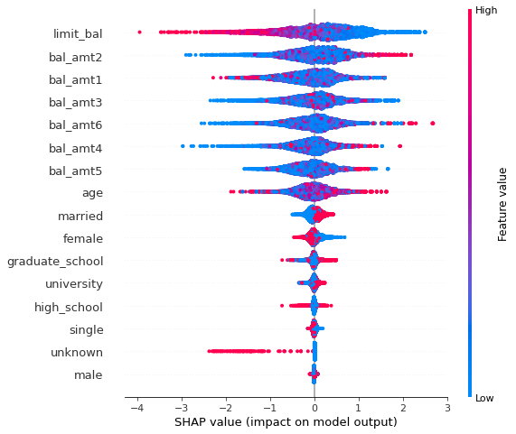

# Data Scientist Challenge

Assume you are working in a credit card company that is expecting a recession in the near future. The company would like to maintain a certain percentage of credit card defaults out of all the users. You will work on a dataset for the set of credit card users and predict the probability of credit card defaults.

## Dataset

This dataset contains information on default payments, demographic factors, credit data, history of payments, and bill statements of credit card clients in Taiwan from April 2005 to September 2005.

## Part 1: Exploratory Data Analysis (EDA) and Extract-Transform-Load (ETL)

- Explore the whole dataset and find any interesting insights
- Evaluate the data quality and figure out whether outliners exist
- Select the strongest predictors and perform feature engineering

**Answer:**

1. `PAY_1` column is not defined in the data dictionary hence discarded.
2. 	`PAY_0`, and `PAY_2` to `PAY_6` were dropped because their inclusion would create multiple categories that have very few elements in each, hence, making the model overfit the train dataset. 
3. The column `ID` is not useful for prediction so it was dropped as well.
4. 	At first sight some records in some of the features do not appear in the data dictionary, e.g. the value of 0 in `EDUCATION` and `MARRIAGE`. While these values might be grouped under others or unknown, unless this is agreed with domain experts, the best practice is to discard them.
	
	
	
5. Combinations of categories with few elements: in the first pass they were kept during training but they hampered the model performance hence they were discarded on the second [iteration of the model](#part-3-model-refinement).
6. A new feature `BAL_AMT = BILL_AMT - PAY_AMT` was created, and `BILL_AMT`, `PAY_AMT` were dropped. Having this feature should capture the same information and also making the model faster to train by having one less feature to train on.
6. The previous steps result in the following features and target, e.g. `default.payment.next.month`:
	
	
	
	From here there are some interesting insights, for example:
	
	- Most of the customers are in the 20-40 years old range.
		
		
	
	- The following plot is representative of the `BAL_AMT` features, which are mostly centered around 0. However, there are some outliers which aren't discarded in this exercise though they could be discarded in further iterations of the model.
	
		
		
	- The target `default.payment.next.month` is unbalanced hence, after doing the train/test split the minority class `default.payment.next.month = 1` will be upscaled. This is done at this stage otherwise there would be [information leakage](https://www.section.io/engineering-education/data-leakage/#:~:text=Data%20leakage%20is%20a%20problem,have%20exaggerated%20results%20during%20training.) from the train into the test set.
	
		
	
	- Some combinations of categorical features have very few elements hence it's hypothesised that they will hamper the model performance.
	
		
	
8. One-hot encoding of the categorical features took place at this stage, before the dataset was split into train/test, allowing the encoder to have access to all the categorical features in the set. 
	

## Part 2: Prediction Modeling

- Train a model to predict whether a user will default or not
- The model is not expected to be perfectly accurate and precise, but instead try to build a simple one involving fewer features based on the limited time frame
- Evaluate the performance of model

**Answer:**

1. I selected an XGBoost classificator model for its versatility at the risk of overfitting the small training dataset. This fact became evident when running the following brief training test. Admittedly, this should be done using a validation set instead of a test set, but it serves to illustrate the point. Having a larger dataset would allow better overfitting analysis by having train/val/test datasets. Currently, the split is train/test 80/20 and then the minority class (`default.payment.next.month = 1`) is randomly upscaled.

	
	
2. After tuning the hyperparameters using GridSearchCV (with 3 folds due to the small amount of data), the resulting model has the following metrics:
	
	``` bash
	Metrics Train - accuracy: 1.0 f1: 1.0 precision: 1.0 recall: 1.0 roc_auc: 1.0
	Metrics Test - accuracy: 0.74 f1: 0.3 precision: 0.37 recall: 0.25 roc_auc: 0.56
	```
	
	
	
	It can be seen that the metrics in the training dataset are significantly better than in the test dataset, a sign that the model is overfitting. Hence in subsequent models a shallower model could be tested.
	
3. I focus on the `ROC_AUC` metric as it is the harmonic mean of precision and recall, avoiding the [accuracy in imbalanced situations trap](https://machinelearningmastery.com/failure-of-accuracy-for-imbalanced-class-distributions/). However, the selection of which metric to focus on can be discussed with the domain experts, hence aligning the model training with the business objectives. 
4. When taking a look into the model performance for combinations of features (categories), I found that the combinations that had fewer elements have hampered the performance of the model, e.g. `education = others` and `marriage = others`.

	
	
	
		
5. Additionally, the same combinations of categories with few elements have little predictive power according to SHAP values.
	
	
	
6. These findings show us several of paths that we could follow to improve the model. These avenues are discussed in the section [Optional](#optional). 
	

## Part 3: Model refinement

While the same approach as in Part 1 and Part 2 was taken, the learnings from that first iteration of the model training were brought forward, for example discarding `education = others` and `marriage = others` resulting in the following categories:


Moreover, after tuning a shallower model (tree depth up to 8), the metrics are as follows: 

```
Metrics Train - accuracy: 0.95 f1: 0.95 precision: 0.92 recall: 0.98 roc_auc: 0.95
Metrics Test - accuracy: 0.7 f1: 0.37 precision: 0.35 recall: 0.39 roc_auc: 0.59
```

which show a slightly lower `ROC_AUC` when comparing the results between the first and second models on the train set, but an improvement second model the test set. Therefore the second iteration of the model shows signs of overfitting reduction, therefore demonstrating that both reducing the complexity of the model and dropping categories help the model predict unseen data.

Moreover, the `ROC_AUC` performance on individual combination of feature categories is generally higher in the second model, though when this is not the case the standard deviation is lower, e.g. `sex = female` and `education = high_school`.


Finally the SHAP importance values show us that the features kept have a similar order and importance as the original model, confirming that keeping such features was the right decision. 



These findings show us a couple of paths that we could follow to improve the model in a further iteration. These avenues are discussed in the section [Optional](#optional). 

## Requirements

- [ x ] Jupyter Notebook for Exploratory Data Analysis (EDA) and Extract-Transform-Load (ETL):

**Answer:**

1. [v0\_Baseline\_FeatureExploration/00\_ExploratoryAnalysis\_ETL.ipynb](v0_Baseline_FeatureExploration/00_ExploratoryAnalysis_ETL.ipynb): 
	- Contains the first pass of EDA and ETL. In this first pass, features that would create subcategories with few items, have multiple nan values or undescribed values were dropped. Additionally, a new feature `BAL_AMT = BILL_AMT - PAY_AMT` was created. 
	- Moreover, it was found that there were outliers in the numerical features, also the categories inside the target were umbalanced. 
	- Finally, the data for training in its original format and one-hot-encoded version, in addition to the encoder were exported.

2. [00\_ExploratoryAnalysis\_ETL](00_ExploratoryAnalysis_ETL.ipynb): 
	- Contains the second iteration of EDA and ETL. Based on the findings of the first model training, some of the categories with few elements were dropped, e.g. `education = others` and `marriage = others`. 
	- The data for training in its original format and one-hot-encoded version, in addition to the encoder were exported.

- [ x ] Jupyter Notebook for Prediction Modeling:

**Answer:**

1. [v0\_Baseline\_FeatureExploration/01\_Model.ipynb](v0_Baseline_FeatureExploration/01_Model.ipynb):
	-  Contains the first pass of the XGBoost model training. The data was splitted in train/test sets using an 80/20 split and stratified according to the distribution of `default.payment.next.month`, e.g. if the customer defaults or not.
	-  The model hyperparameters were tuned using GridSearchCV. 
	-  The training results show that, as expected, the categories  with few elements, e.g. `education = others` and `marriage = others`, impacted the model negatively and had low predictive power according to the SHAP values, hence in the next model iteration they are discarded.

2. [01\_Model.ipynb](v0_Baseline_FeatureExploration/01_Model.ipynb): 
	- Contains the second iteration of the XGBoost model. 
	- Following the same ETL and split procedure as in the first pass, the training results show that in general there has been an increase in `ROC_AUC` by several percentage points for most categories or a reduction in the standard deviation. Therefore, confirming that the categories with few elements, e.g. `education = others` and `marriage = others`, impacted the model negatively. 
	- Moreover, the category `education = unknown` might also be considered to be discarded, but this is left for a further iteration of the model.

- [ x ] Implementation in Python of a simple data model that can be trained and predict whether a user will default or not, let us know if you prefer something other than Python

**Answer:**

There are two python scripts for which the instructions on how to run them can be found in the [Deliverables](#deliverables) section which mainly involve activating the virtual environment.

1. `model_training.py` trains a model based on the findings of `00_ExploratoryAnalysis_ETL.ipynb` and `01_Model.ipynb`
2. `model_inference.py` takes a file with exactly the same features as `data.csv` and makes predictions, returning the output metrics.
3. `model_inference.py` could be adapted to receive command line arguments to make single predictions based on a single user, though this could be easily implemented on request. 

## Optional

- [ x ] Draft a plan with multiple phases of work on how to tackle the problem, let us know what are the tradeoffs and considerations

**Answer:**

The general strategy was to:
	
1. Do a first pass to create a model baseline, of which subsequent models could be compared against, doing a minimal ETL and feature creation that can be found in [v0\_Baseline\_FeatureExploration](v0_Baseline_FeatureExploration).
2. Implement some of the learnings from the first pass and iterate in the feature creation and model training which can be found in [the current root folder](.).
	
These two iterations followed the same general approach, that is to divide the work into two stages:

-  Stage 1 - Import data, evaluate its quality and peformed feature selection, that was done in the `00_ExploratoryAnalysis_ETL.ipynb` files, in particular:
	- Discarded features with multiple nan's or that aren't explained by the data dictionary.
	- Identified numerical outliers, which were kept in place to allow establishing a model baseline. Discarding these numerical outliers could be done in a third pass of the model.
	- The combinations of categories with few elements, were kept in the first pass. However, these combinations of categories hampered the model's performance, hence they were discarded in the second iteration of the model.
	- Created a new feature `BAL_AMT = BILL_AMT - PAY_AMT`, and dropped  `BILL_AMT`, `PAY_AMT`. Having this feature should capture the same information and also make the model training faster by having one less feature to train on.
	- One-hot encoded the categorical features before splitting the dataset into train/test. This way, the encoder has access to all the categorical features in the set. Regardless, the encoder has the option `handle_unknown='ignore'`, allowing the encoder to manage possibly unknown categories inside of the categorical features. 

- Stage 2 - Model training, done in `01_Model.ipynb` files, for example:
	- Imbalanced predictive class: upscaled the minority class, e.g. `default.payment.next.month = 1`, thus retaining the richness of the majority class features.
	- Used an XGBoost classifier which is a versatile and powerful model, that doesn't require feature scaling. Moreoveor, it is not affected by multicollinearity by construction but is prone to overfitting in small datasets such as this one.
	- Tuned the model's hyperparameters using GridSearchCV, this procedure could instead be done using a Bayesian or another hyperparameter method that allows educated guesses of hyperparameters resulting in fewer evaluations and a more accurate model.

- [ x ] Let us know what improvements can be made if we have more time and resources

**Answer:**

1. From the first model training I can suggest the following.

	Dataset and feature improvements:
	
	- The categories with small number of records, for example `education = others` and `marriage = others`, could be discarded as they have hampered the training metrics and have low predictive power according to Shap and feature importances.
	- Alternatively, embeddings could be created for the combination of categories with small number of records.
	- Limit outliers in numerical features, for example using inter-quantile ranges.
	- Perform more advanced categorical feature selection, for example using Chi-Squared, Mutual or others.
	
	Additionally, acquiring a larger dataset that could unlock the following advantages:
	
	- Increasing the number of elements in the categories with small number of items.
	- Consider including the `PAY` features if there is enough data to produce combination of categories with significant number of items.
	- Have a validation dataset would help analysom overfitting.
	
	In terms of model training and evaluation:
	
	- Implement a better hyperparameter optimisation method for example a Bayesian-based one.
	- Study the model decision tree. Currently, the necessary libraries, in particular Graphviz, make the development environment difficult to share hence not used.
	- Evaluate other models, perhaps a Neural Network. Based on past experience, this effort may not pay off.
	- In-depth discussion between data science, domain experts and management about the trade-offs between different model metrics.

2. From the second iteration of model training I can add that:

	Dataset and feature improvements:
	
	- The categories with small number of records, could be merged into one, e.g. `education = unknown; education = others`.
	
	In terms of model training and evaluation:
	
	- The model is overfitting the training dataset, thus performing worse in the test dataset, therefore this is an area to improve. 

## Deliverables

- [ x ] Jupyter Notebooks (Hosted on Github, Bitbucket, etc.)

**Answer:**

Please do check [https://github.com/InHouse-Banana/DataScientistChallenge](https://github.com/InHouse-Banana/DataScientistChallenge).

- [ x ] Documentation on how to run the them

**Answer:**

1. To run the training source code it requires a Conda installation
2. Create a conda environment from `env.yml` and if you’d like to run the notebooks, register this environment with jupyter. For example:
	- `conda env create --file env.yml`
	- `conda activate env`
	- `python -m ipykernel install --user --name=env`
3. To run the training script, after activating the env, please execute the following commands.  The script will take care of ETL, feature creation and model tuning.
	- Requires data training source files to be located in in `dataset/data.csv`.
	- Execute: `python model_training.py`
4. To run inference execute `python model_inference.py`, which takes a `source-file` with exactly the same features as `data.csv`, makes defaulting predictions and returns the metrics.


The model training, e.g.  `python model_training.py`,  will output:

```
training_data_file      csv file that contains the features and the respective targets
features_targets_file   csv file that contains the one-hot encoded features and the respective targets
combinations_cats       csv file that contains the category combinations counts
enc                     encoder that performs one-hot-encoding with handle_unknown='ignore'
model                   tuned xgboost model

Prints [acc, f1, prec, rec, roc_auc] for train and test datasets
```

Moreover, executing `python model_training.py --help` returns the list of optional args:

``` bash
  --source-file SOURCE_FILE
                        file containing the features and targets to calculate metrics
  --model_file MODEL_FILE
                        where the model will be saved model
  --enc_file ENC_FILE   where the encoder will be saved
  --n_jobs N_JOBS       number of cores for the model to use
```	

Executing model inference, `python model_inference.py`,  will output the metrics for the given file:

```
    Prints [acc, f1, prec, rec, roc_auc, shape_x, shape_y]
```

Moreover, executing `python model_inference.py --help` returns the list of optional args:

``` bash
--source-file SOURCE_FILE
                    file containing the features and targets to calculate metrics
--model_file MODEL_FILE
                    model file location that will be tested
--enc_file ENC_FILE   encoder file locations to one-hot features
```	

## Grading and Submission Requirements

- Graded based on thought process and completeness of modeling work flow. The model will only be expected to perform reasonably accurate and precise within limited time.

## Data Dictionary

| Data | Definition | Value(s) |
| --- | --- | --- |
| ID | ID of each client | |
| LIMIT_BAL | Amount of given credit in NT dollars (includes individual and family/supplementary credit | |
| SEX | Gender | (1=male, 2=female) |
| EDUCATION | Education | (1=graduate school, 2=university, 3=high school, 4=others, 5=unknown, 6=unknown) |
| MARRIAGE | Marital status | (1=married, 2=single, 3=others) |
| AGE | Age in years | |
| PAY_0 | Repayment status in September, 2005 | (-1=pay duly, 1=payment delay for one month, 2=payment delay for two months, … 8=payment delay for eight months, 9=payment delay for nine months and above) |
| PAY_2 | Repayment status in August, 2005 | (scale same as above) |
| PAY_3 | Repayment status in July, 2005 | (scale same as above) |
| PAY_4 | Repayment status in June, 2005 | (scale same as above) |
| PAY_5 | Repayment status in May, 2005 | (scale same as above) |
| PAY_6 | Repayment status in April, 2005 | (scale same as above) |
| BILL_AMT1 | Amount of bill statement in September, 2005 (NT dollar) | |
| BILL_AMT2 | Amount of bill statement in August, 2005 (NT dollar) | |
| BILL_AMT3 | Amount of bill statement in July, 2005 (NT dollar) | |
| BILL_AMT4 | Amount of bill statement in June, 2005 (NT dollar) | |
| BILL_AMT5 | Amount of bill statement in May, 2005 (NT dollar) | |
| BILL_AMT6 | Amount of bill statement in April, 2005 (NT dollar) | |
| PAY_AMT1 | Amount of previous payment in September, 2005 (NT dollar) | |
| PAY_AMT2 | Amount of previous payment in August, 2005 (NT dollar) | |
| PAY_AMT3 | Amount of previous payment in July, 2005 (NT dollar) | |
| PAY_AMT4 | Amount of previous payment in June, 2005 (NT dollar) | |
| PAY_AMT5 | Amount of previous payment in May, 2005 (NT dollar) | |
| PAY_AMT6 | Amount of previous payment in April, 2005 (NT dollar) | |
| default.payment.next.month | Default payment | (1=yes, 0=no) | |
